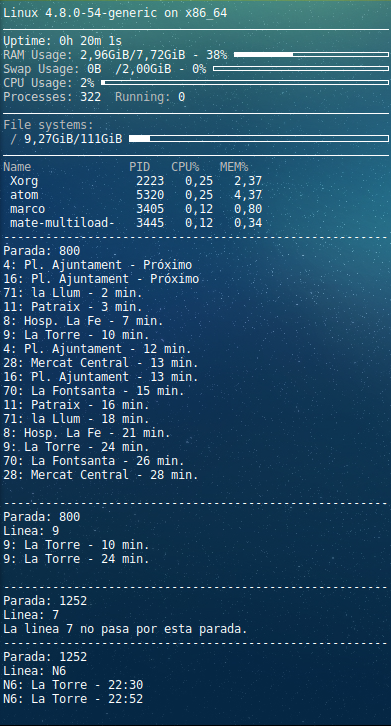
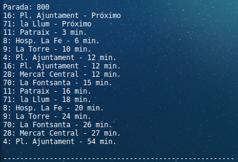
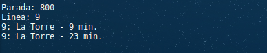
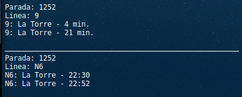
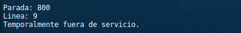
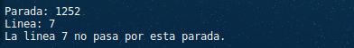

# Conky EMT Valencia

Módulo que permite añadir la información de los próximos buses a tu configuración de Conky.



### Instalación
- Descargar o clonar el repositorio: [ZIP](https://github.com/andoniaf/conky_emtVLC/archive/master.zip)
```
git clone git@github.com:andoniaf/conky_emtVLC.git
```

- Añade una linea como la siguiente a tu configuración de Conky:
```
${execpi 30 python3 /route/to/path/emtVlc.py 800 9}
```

### Configuración
```
${execpi 30(a) python3 /route/to/path/emtVlc.py(b) 800(c) 9(d)}
```
a) Este valor indica cada cuantos segundos se actualiza la información.

b) Ruta hasta el módulo. (*Tambien tendrás que configurar esa linea en el fichero **emtVlc.py***)

```
# VARS
path = "/route/to/path/emtVLC_conky/"
```

c) Número de la parada

d) [Opcional] Nombre de la linea (*en caso de que solo quieras consultar una sola linea de la parada*).

### Ejemplos de configuración
- Muestra **todas** las lineas de la parada **800**, actualiza cada **30** segundos:
```
${execpi 30 python3 /home/aalonsof/PycharmProjects/emtVLC_conky/emtVlc.py 800 }
```


- Muestra **solo** la linea **9** de la parada **800**, actualiza cada **50** segundos:
```
${execpi 50 python3 /home/aalonsof/PycharmProjects/emtVLC_conky/emtVlc.py 800 9 }
```


- Muestra las **lineas 9 y N6** de la parada 1252, actualiza czada **30** segundos::
```
${execpi 30 python3 /home/aalonsof/PycharmProjects/emtVLC_conky/emtVlc.py 1252 9 }
$hr
${execpi 30 python3 /home/aalonsof/PycharmProjects/emtVLC_conky/emtVlc.py 1252 N6 }
```


### Errores frecuentes
- Mensaje indicando que esta temporalmente fuera de servicio:
   - Este error suele aparecer cuando la web de la EMT no devuelve información, cuando actualiza la información desaparece.

   

- Mensaje indicando que "La linea X no pasa por esta parada.":
   - Como indica el error, comprueba que la linea pasa por esa parada.

   

- Mensaje indicando que "No has introducido un número de parada valido.":
  - Comprueba que la parada existe y no hay ningún carácter extraño.


- Mensaje indicando que "Todavia no hay estimaciones para la linea X en esta parada.":
  - Este error aparece cuando la linea se corresponde con la parada pero aun no hay datos. Suele ocurrir cuando se consultan linea nocturnas durante la mañana.


### Información adicional
- [Plano](https://www.emtvalencia.es/geoportal/) de EMT Valencia para consultar las paradas.
- Información sobre lineas y paradas de la EMT obtenida del [Portal de Transparencia del Ayuntamiento de Valencia](http://gobiernoabierto.valencia.es/va/data/)
  - Actualizadas a mano varias Lineas.
- [Ejemplo completo](https://gist.github.com/andoniaf/ac9a04b2746196475322cd5dde5a9036) de un fichero de configuración de Conky.
