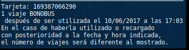
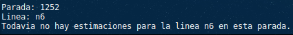

# Conky EMT Valencia

**(Deprecated, ver https://github.com/andoniaf/pyemtvlc)**

Módulo que permite añadir la información de los próximos buses a tu configuración de Conky.


### Instalación
- Descargar o clonar el repositorio: [ZIP](https://github.com/andoniaf/conky_emtVLC/archive/master.zip)
```
git clone https://github.com/andoniaf/conky_emtVLC.git
```

- Instalar dependencias:
```
pip3 install -r requirements.txt
```

### Formas de uso
##### - Consulta de paradas:
```
python3 /route/to/path/emtVlc.py(a) 800(b) 9(c)
```
a) Ruta hasta el módulo.

b) Número de la **parada**.

c) [Opcional] Nombre de la **linea** (*en caso de que solo quieras consultar una sola linea de la parada*).


##### - Consulta saldo de la tarjeta:
```
python3 /route/to/path/emtVlc.py(a) -s(b) 9(c)
```
a) Ruta hasta el módulo.

b) Parametro que indica que se esta consultando el **saldo**.

c) Número de la **tarjeta**.


### Configuración en Conky
- Añade una linea como la siguiente a tu configuración de Conky:
```
${execpi 30(a) python3 /route/to/path/emtVlc.py 800 9}
```
a) Este valor indica cada cuantos segundos se actualiza la información.

### Ejemplos de configuración
- Muestra **todas** las lineas de la parada **800**, actualiza cada **30** segundos:
```
${execpi 30 python3 /home/aalonsof/PycharmProjects/emtVLC_conky/emtVlc.py 800 }
```


- Muestra **solo** la linea **9** de la parada **800**, actualiza cada **50** segundos:
```
${execpi 50 python3 /home/aalonsof/PycharmProjects/emtVLC_conky/emtVlc.py 800 9 }
```


- Muestra las **lineas 9 y N6** de la parada 1252, actualiza czada **30** segundos::
```
${execpi 30 python3 /home/aalonsof/PycharmProjects/emtVLC_conky/emtVlc.py 1252 9 }
$hr
${execpi 30 python3 /home/aalonsof/PycharmProjects/emtVLC_conky/emtVlc.py 1252 N6 }
```


- Muestra la información de la **tarjeta** '169387066291':
```
${execpi 30 python3 emtVlc.py -s 169387066291 }
```


### Errores frecuentes
- Mensaje indicando que esta *temporalmente fuera de servicio*:
   - Este error suele aparecer cuando la web de la EMT no devuelve información, cuando actualiza la información desaparece.

   

- Mensaje indicando que "*La linea X no pasa por esta parada.*":
   - Como indica el error, comprueba que la linea pasa por esa parada.

   

- Mensaje indicando que "*No has introducido un número de parada valido.*":
  - Comprueba que la parada existe y no hay ningún carácter extraño.


- Mensaje indicando que "*Todavía no hay estimaciones para la linea X en esta parada.*":
  - Este error aparece cuando la linea se corresponde con la parada pero aun no hay datos. Suele ocurrir cuando se consultan linea nocturnas durante la mañana.

      


### Información adicional
- [Plano](https://www.emtvalencia.es/geoportal/) de EMT Valencia para consultar las paradas.
- Información sobre lineas y paradas de la EMT obtenida del [Portal de Transparencia del Ayuntamiento de Valencia](http://gobiernoabierto.valencia.es/va/data/)
  - Actualizadas a mano varias Lineas.
- [Ejemplo completo](https://gist.github.com/andoniaf/ac9a04b2746196475322cd5dde5a9036) de un fichero de configuración de Conky.
